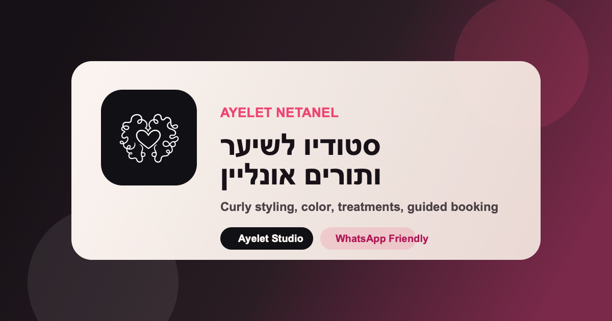

# Ayelet Netanel Studio



A bilingual salon website for Ayelet Netanel Studio with a guided booking flow, inspiration gallery, service catalog, WhatsApp-first handling for highlights, and an admin workspace for appointments, availability, services, and studio settings.

## What This Project Includes

- Public marketing site with Hebrew-first styling and bilingual copy.
- Guided booking flow that requires login or registration before entering the appointment flow.
- Service catalog with special WhatsApp routing for highlights bookings.
- Inspiration gallery that can deep-link into booking with a selected service.
- Admin surface for bookings, services, blocked dates, weekly schedule, and studio settings.
- Frontend `Vite + React 19 + TypeScript` app with a lightweight `Express` backend for bookings and notifications.

## Stack

- Frontend: `React 19`, `TypeScript`, `React Router`, `Motion`, `Tailwind CSS v4`
- Backend: `Express`, `tsx`
- Data/Auth/Storage: `Firebase`, `Firestore`, `Firebase Auth`, `Firebase Storage`
- Notifications/Integrations: Firebase Admin, WhatsApp provider environment hooks

## Main Flows

### Public Site

- `/` home page
- `/services` service catalog
- `/gallery` inspiration gallery
- `/contact` studio contact details

### Protected Client Flow

- `/login` customer login or simple registration
- `/book` guided booking flow
- `/confirmation` booking confirmation

### Protected Admin Flow

- `/admin/*` studio management workspace

## Branding Assets

Brand assets now live in `public/brand/`:

- `ayelet-mark-dark.svg`: dark logo mark for light surfaces
- `ayelet-mark-light.svg`: light logo mark for dark surfaces
- `ayelet-mark-pink.svg`: accent logo mark
- `apple-touch-icon.png`: touch icon for saved shortcuts
- `social-preview.png`: Open Graph / WhatsApp preview image

Browser-facing metadata is configured in `index.html`:

- favicon switches by `prefers-color-scheme`
- `theme-color` switches for light and dark system mode
- Open Graph and Twitter metadata point to the branded social preview image

## Local Development

### Prerequisites

- Node.js 20+
- npm

### Install

```bash
npm install
```

### Run The Frontend

```bash
npm run dev
```

Default local URL:

```text
http://localhost:3000
```

### Run The Backend

```bash
npm run server
```

Default local API URL:

```text
http://localhost:3001
```

The frontend proxies `/api/*` requests to the backend using the port from `PORT` in your env file.

## Environment Setup

Copy the example file:

```bash
cp .env.example .env
```

Important values in `.env.example`:

- `PORT`: backend port, defaults to `3001`
- `ALLOWED_ORIGINS`: comma-separated origins allowed by the backend
- `FIREBASE_*`: Firebase Admin and database credentials
- `OWNER_PHONE`: owner number used by the studio flows
- `STUDIO_NAME`: branding / studio label
- `GREEN_API_*` or `TWILIO_*`: optional WhatsApp notification providers

The client Firebase config is loaded from `firebase-applet-config.json`.

## Available Scripts

```bash
npm run dev           # start Vite dev server on port 3000
npm run server        # start Express backend
npm run server:watch  # backend in watch mode
npm run build         # production build
npm run preview       # preview production build
npm run clean         # remove dist
npm run lint          # TypeScript type-check
```

## Project Structure

```text
src/
  components/   shared UI shell, toast, error boundary, brand logo
  i18n/         language provider and translations
  pages/        Home, Services, Gallery, Login, Book, Contact, Confirmation, Admin
  services/     client-side data and upload flows
  utils/        display, date, gallery helpers

server/
  middleware/   auth and error handling
  routes/       bookings and notifications APIs
  services/     Firebase Admin, scheduler, notifier, validation
```

## Notes For Deployment

- Make sure `/brand/social-preview.png` is publicly reachable from the deployed site root so link previews can fetch it.
- If you deploy under a sub-path instead of the site root, review the asset URLs in `index.html` and `site.webmanifest`.
- For social link previews in WhatsApp, the deployed server must return the Open Graph tags from `index.html` and allow the image to be fetched without authentication.

## Validation

Typical validation commands:

```bash
npm run build
npm run lint
```

For visual verification, also check:

- favicon in both light and dark OS modes
- Open Graph preview tags after deployment
- login-required gate before `/book`
- logo rendering in header, footer, login, and admin surfaces
